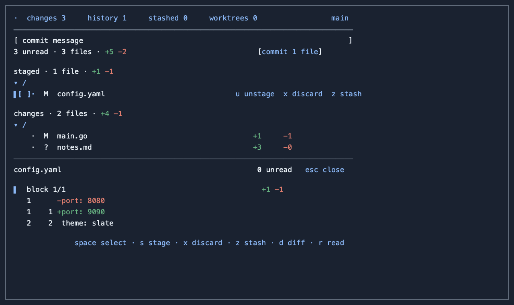

# mirugit

A terminal pane that shows what a git repository currently holds, and lets you
act on it with one key.

It also keeps your place. Diff blocks you have been shown are marked read. The
history tab shows the Git author for each commit, so you can review changes
without losing your place.



Every verb the footer prints is a key you can press on the row the cursor is
on. Nothing is offered that cannot be pressed, and nothing that can be pressed
is hidden.

## What it does

Four tabs over one repository:

| Tab | Shows | Acts |
|---|---|---|
| changes | staged and unstaged files, grouped by directory | stage, unstage, discard, stash, commit |
| history | commits, with the files each one touched and the Git author name | diff, copy SHA, open a pushed commit on the remote, undo the newest unpushed one |
| stashed | stashes and the files inside them | restore and drop, or branch and drop when the stash would conflict or come from an unrelated history |
| worktrees | worktrees and how far each has diverged | go, remove |

Diffs open in the same pane, one block at a time. Blocks you have read are
marked, so returning to a file tells you where you stopped. When a file changes
on disk while its diff is open, the row says `stale · R reload` rather than
showing you a diff that no longer matches the repository.

A stashed row marked `unrelated` comes from a history that cannot be compared
with the current `HEAD`. mirugit keeps the stash, withholds restore, and leaves
branch and drop available.

The pane watches the repository and redraws when it changes. It writes to the
repository only when you press a key that says it will. At startup it also
prunes its snapshot refs under `refs/mirugit/undo/`.

## What it does not do

mirugit reads one repository and acts on the current view. It does not offer
the following Git operations, except for the explicit actions listed here.

- **It does not move you between branches or commits.** No checkout, no switch,
  no branch creation, no tag. Two keys are the exceptions and both say so where
  they are listed: `g` on the worktrees tab points the pane at another worktree
  without touching the one you are in, and `b` on the stashed tab runs
  `git stash branch`, which makes a branch and checks it out.
- **It does not rewrite history.** No rebase, no cherry-pick, no revert, no
  amend, no force push. `u` on the history tab runs `git reset --soft HEAD^`,
  which moves the branch and keeps every file; the commit stays in `git reflog`.
- **It does not merge, and it does not resolve conflicts.** `git merge` is not
  one of the commands it runs. A conflicted file is drawn with its markers and
  the footer says `resolve in your editor`. mirugit tells you a merge, rebase,
  cherry-pick, revert, bisect or `git am` is in progress, and prints the git
  command that finishes or abandons it, but runs neither.
- **It does not stage part of a block.** `s` on a diff block stages that whole
  block. Line-by-line selection is what `git add -p` is for.
- **It does not contact a remote on its own.** `f` runs `git fetch` and `S`
  runs `git pull --ff-only` then `git push`, only when pressed. `o` opens a
  pushed commit in your browser. There is no telemetry.

## Install

Every route needs **git 2.41 or newer** on `PATH`. Two commands set that floor
and neither has a fallback: `for-each-ref`'s `ahead-behind` field, which the
worktrees tab reads, and `merge-tree --write-tree`, which decides whether a
stash still applies. mirugit checks the version at startup and refuses with a
one-line message naming what to install.

Run `git --version` to see what you have. A distribution that ships an older
git usually offers a newer one: `brew install git` on macOS, the
[git-core PPA](https://launchpad.net/~git-core/+archive/ubuntu/ppa) on Ubuntu.

**Windows is not supported.** mirugit stops a hung git by signalling its process
group, which has no Windows equivalent. It builds there and refuses to run, with
one line saying why: shipping a binary nobody has run would be claiming support
that was never checked.

**A release binary.** Nothing else required. Archives are available for Linux
and macOS on amd64 and arm64. Pick your platform from
[the releases page](https://github.com/catpotd/mirugit/releases), then:

```
tar -xzf mirugit-<version>-<os>-<arch>.tar.gz
mkdir -p ~/.local/bin
install -m 0755 mirugit-<version>-<os>-<arch>/mirugit ~/.local/bin/mirugit
```

Make sure `~/.local/bin` is on your `PATH`.

`checksums.txt` on the same page carries the SHA-256 of each archive. Each
archive also holds `THIRD_PARTY_NOTICES.txt`, the license of every module linked
into the binary.

**`go install`.** Requires Go 1.26 or later. The binary lands in `$GOBIN`, or
`$(go env GOPATH)/bin` when that is unset. `mirugit -version` then reports the
tag it was built from, because the module system records it.

```
go install github.com/catpotd/mirugit/cmd/mirugit@latest
```

## Run

```
mirugit
```

It reads the repository containing the current directory. `q` quits, `?` opens
the key list, and every key in that list also works as a click.

Two flags: `-C <dir>` reads another repository, and `-version` prints the build
and exits. Put the `-version` output in any bug report.

## What each key can undo

These keys change the repository in a way `git status` will not show you how to
reverse. This is what each one costs.

| Key | What it runs | Getting it back |
|---|---|---|
| `x` discard | asks first, then removes the change from the working tree | `U` restores the newest discard while mirugit is running. Before removing anything, mirugit writes the files to a commit under `refs/mirugit/undo/`, including untracked ones. |
| `x` drop (stashed tab) | asks first, then `git stash drop` | **Not recoverable from mirugit.** git leaves the commit unreachable; `git fsck --unreachable` may still find it until the next `git gc`. The footer says so before you confirm. |
| `x` remove (worktrees tab) | asks first, then `git worktree remove` | The tree's directory goes. Its branch and its commits stay, so `git worktree add` puts it back. mirugit withholds the key while the tree has uncommitted changes. |
| `b` branch (stashed tab) | `git stash branch`, no question asked | Switches you to a new branch, so what you were on is left behind uncommitted. The stash is dropped only when the branch checkout was clean; a working tree with changes keeps it. |
| `S` sync | `git pull --ff-only` then `git push`, no question asked | The pull only fast-forwards, so it cannot lose local work. The push is on the remote once it lands; undoing it is a force push mirugit will not do for you. |
| `u` uncommit (history tab) | `git reset --soft HEAD^`, no question asked | The commit's files land in the staged area and the commit stays in `git reflog` for as long as git keeps it (90 days by default). Committing again restores it — but if other files were already staged, the new commit holds them too. |

The commits under `refs/mirugit/undo/` are the only trace mirugit leaves in your
repository. It keeps the newest 100 and drops any older than 14 days, on
startup. `git for-each-ref refs/mirugit/undo/` lists them and
`git update-ref -d <ref>` removes one.

## Keys

Every key here also works as a click on the word the footer or the help prints.

| Key | Does |
|---|---|
| `j` `k` `↑` `↓` | move the cursor |
| `pgup` `pgdn` | move a page |
| `home` `end` | first, last row |
| `space` | select the row (changes only) |
| `a` | select everything in the tab |
| `shift`+`j` `shift`+`k` | extend the selection |
| `←` `→` | fold, unfold the directory |
| `esc` | clear the selection, or close the diff |
| `s` | stage |
| `u` | unstage; on history, uncommit the newest unpushed commit |
| `x` | discard, drop the stash, or remove the worktree, by tab |
| `z` | stash |
| `U` | undo the last discard |
| `p` `b` | restore a stash, branch from a stash (stashed only) |
| `g` | switch to the worktree under the cursor |
| `d` `enter` | open the diff |
| `n` `shift`+`n` | next, previous diff block |
| `r` | mark read without opening |
| `y` `o` | copy a commit SHA, open it on the remote |
| `c` | write a commit message |
| `R` | reload |
| `f` | fetch |
| `S` | sync, pull then push |
| `1` `2` `3` `4` `tab` | switch tabs |
| `?` | key list |
| `q` `ctrl`+`c` | quit |

A key that does nothing on the current tab is not printed in the footer there.
The footer only names verbs you can press on the row the cursor is on.

## Mouse

Moving the pointer changes nothing. The cursor moves when you click, and a click
anywhere on a row puts it there — the name covers only a few of the columns the
pointer is usually on.

| Where you click | What happens |
|---|---|
| a file row | the cursor goes there and the diff opens |
| a commit, stash or worktree row | the cursor goes there and the row's files open under it |
| `[ ]` | select the row; `shift`+click extends the selection |
| `[-]` on a heading | select everything under it |
| a verb, such as `u unstage` | run it |
| a directory row | fold, unfold |
| a tab name | switch tabs |
| `[ commit message ]`, `[commit N files]` | write a message, commit |
| `?` and each line of the key list | open the list, run that line |
| a diff block | move the block cursor there |

The wheel scrolls the list, and moves the block cursor when the pointer is on
the diff.

## What stays the same between versions

mirugit is at 0.x. That means the keys and the files below can change, but not
without saying so in the release notes.

| Thing | Promise |
|---|---|
| Key assignments | A key that runs a destructive verb (`x`, `u`) will not be given to a different verb without a minor version bump and a note. |
| `-C` and `-version` | Stay. New flags may be added. |
| `~/.local/state/mirugit/` (or `$XDG_STATE_HOME`) | Read marks only. A format change bumps the version inside the file and mirugit starts with no marks rather than failing; it never reads a file it does not understand. |
| `refs/mirugit/undo/` | The prefix stays. Deleting these refs is always safe; they only cost you `U`. |
| Terminal output | Not an interface. Do not parse it. |

Generated release notes list merged pull requests by title.
Changes to any promise in this table are called out before that list.

`NO_COLOR` set to anything turns color off. `MIRUGIT_THEME` picks a palette:
`slate` is the default and `cozmic` is the other. An unknown name falls back to
`slate`. Both are read at startup and nowhere else.

**If your terminal draws `·` `→` `▌` two columns wide, set
`RUNEWIDTH_EASTASIAN=1`.** These characters are "ambiguous width": Unicode lets
a terminal choose. mirugit measures its own padding by asking the terminal at
startup, but the library that puts the lines on the screen reads that variable
instead, once, before mirugit runs.

When the two disagree, the rows holding one of these characters are the ones
that go wrong: each is drawn twice, one under the other, and the rows without
them stay put. Set the variable if that is what you see and it is not, and unset
it if that is what you see and it is. `MIRUGIT_THEME` and `NO_COLOR` do not
affect this.

## Contributing

See [CONTRIBUTING.md](CONTRIBUTING.md) for setup and pull request guidance.
Report vulnerabilities using [SECURITY.md](SECURITY.md). See
[CODE_OF_CONDUCT.md](CODE_OF_CONDUCT.md) for community expectations.

## License

[MIT](LICENSE)
